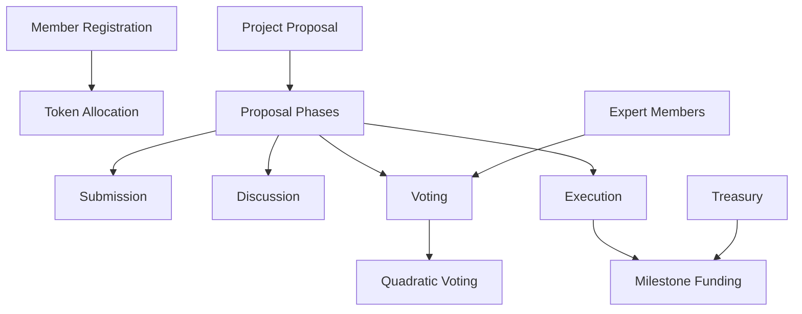

# Multicast Standard: Decentralized Governance Protocol

A flexible, secure governance protocol designed for decentralized decision-making across diverse domains, enabling transparent and efficient community collaboration.

## Overview

Multicast Standard creates a flexible, secure governance framework that enables community-driven decision-making across various domains. The protocol allows participants to:

- Create and submit proposals
- Engage in transparent voting processes
- Delegate voting power
- Manage milestone-based funding
- Implement adaptive governance models

## Architecture

The DAO operates through a single smart contract that manages membership, governance, proposal lifecycle, and treasury operations.



### Core Components

1. **Membership System**
   - Token-based membership
   - Expert member designation
   - Vote delegation capabilities

2. **Proposal Lifecycle**
   - Four distinct phases: Submission, Discussion, Voting, Execution
   - Milestone-based funding distribution
   - Quadratic voting mechanism

3. **Treasury Management**
   - Secure fund storage
   - Milestone-based disbursement
   - Balance tracking

## Contract Documentation

### loom-dao.clar

The main contract managing all DAO operations.

#### Key Functions

1. Member Management
```clarity
(define-public (register-member (token-amount uint) (is-expert bool)))
(define-public (delegate-votes (delegate principal)))
(define-public (remove-delegation))
```

2. Proposal Management
```clarity
(define-public (create-proposal (title (string-ascii 100)) 
                               (description (string-utf8 1000))
                               (link (string-ascii 255))
                               (funding-amount uint)
                               (milestones (list 10 {...}))))
```

3. Voting and Execution
```clarity
(define-public (vote-on-proposal (proposal-id uint) (vote-for bool)))
(define-public (execute-proposal (proposal-id uint)))
(define-public (complete-milestone (proposal-id uint) (milestone-index uint)))
```

## Getting Started

### Prerequisites

- Clarinet
- Stacks wallet
- LOOM tokens for membership

### Basic Usage

1. Register as a member:
```clarity
(contract-call? .loom-dao register-member u1000 false)
```

2. Create a proposal:
```clarity
(contract-call? .loom-dao create-proposal "Sustainable Cotton Alternative" 
                "Development of bamboo-based fabric" 
                "https://example.com/proposal" 
                u10000 
                milestones)
```

3. Vote on a proposal:
```clarity
(contract-call? .loom-dao vote-on-proposal u1 true)
```

## Function Reference

### Member Functions

| Function | Description | Parameters |
|----------|-------------|------------|
| register-member | Join the DAO | token-amount: uint, is-expert: bool |
| delegate-votes | Delegate voting power | delegate: principal |
| remove-delegation | Remove vote delegation | None |

### Proposal Functions

| Function | Description | Parameters |
|----------|-------------|------------|
| create-proposal | Submit new proposal | title: string, description: string, link: string, funding-amount: uint, milestones: list |
| vote-on-proposal | Cast vote | proposal-id: uint, vote-for: bool |
| finalize-proposal | Complete voting phase | proposal-id: uint |

## Development

### Testing

1. Clone the repository
2. Install Clarinet
3. Run tests:
```bash
clarinet test
```

### Local Development

1. Start Clarinet console:
```bash
clarinet console
```

2. Deploy contract:
```bash
clarinet deploy
```

## Security Considerations

### Access Control
- Only members can create proposals and vote
- Milestone funding requires proper phase progression
- Expert status changes restricted (admin function)

### Treasury Security
- Milestone-based fund release
- Balance checks before disbursement
- Proposal state validation

### Voting Protection
- One vote per proposal per member
- Quadratic voting to prevent token concentration
- Mandatory phase progression

### Known Limitations
- Simplified quadratic voting calculation
- Basic treasury management
- Limited proposal parameter validation